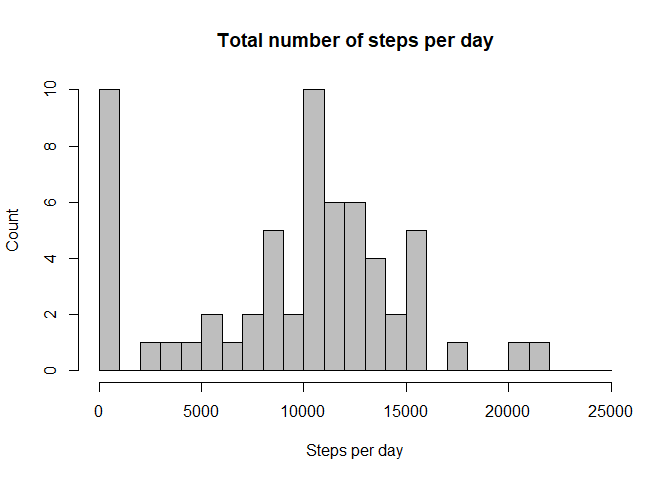
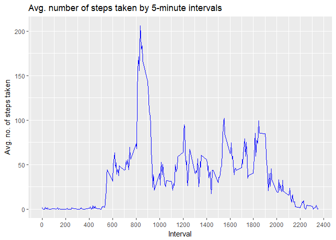
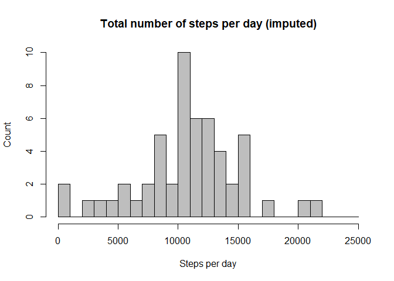
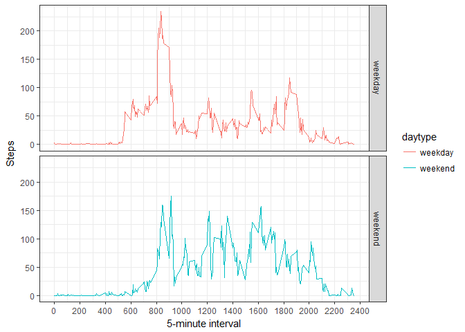

### Loading and preprocessing the data

------------------------------------------------------------------------

First the activity data was downloaded.

    download.file("https://d396qusza40orc.cloudfront.net/repdata%2Fdata%2Factivity.zip", "activity.zip")

Data was then loaded into the workspace and the date variable was
converted to an actual date variable.

    a <- read.csv(unz("activity.zip", "activity.csv"), na.strings = "NA")
    a$date <- as.Date(a$date)

 

### What is mean total number of steps taken per day?

------------------------------------------------------------------------

The total number of steps per day were first calculated.

    totalStepsDay <- aggregate(a$steps, by=list(a$date), FUN=sum,na.rm=TRUE)
    names(totalStepsDay) <- c("date", "steps")

The histogram was then be produced and mean/median reported.

    hist(totalStepsDay$steps, 
         breaks = seq(0,25000, by = 1000), 
         col = "grey", 
         main = "Total number of steps per day", 
         xlab = "Steps per day",
         ylab = "Count"
         )

    summary(totalStepsDay$steps, na.rm = TRUE)

    ##    Min. 1st Qu.  Median    Mean 3rd Qu.    Max. 
    ##       0    6778   10400    9354   12810   21190

 

### What is the average daily activity pattern?

------------------------------------------------------------------------

First the average number of steps per interval across all days was
calculated.

    meanStepsDay <- aggregate(a$step, by = list(a$interval), FUN = mean, na.rm = TRUE)
    names(meanStepsDay) <- c("interval", "steps")

The time-series plot could then produced.

    #Generate time-series plot
    g <- ggplot(meanStepsDay, aes(interval, steps, group = 1))
    g+geom_line(color="blue")+
            scale_x_continuous(breaks = seq(0, 2400, by = 200))+ 
            labs(x ="Interval",y = "Avg. no. of steps taken", title = "Avg. number of steps taken by 5-minute intervals")

And the 5-minute interval with the highest avg. steps per day found.

    meanStepsDay[order(meanStepsDay$steps, decreasing = TRUE),][1,]

    ##     interval    steps
    ## 104      835 206.1698

 

### Imputing missing values

------------------------------------------------------------------------

The number of missing values was first determined.

    sum(is.na(a))

    ## [1] 2304

Interval means to used to replace missing values.

    a$intervalMean[match(a$interval, meanStepsDay$interval)] <- meanStepsDay$steps

A new dataset was then created with the missing data filled in

    aImp <- transform(a, steps = ifelse(is.na(steps), intervalMean, steps))

Using this dataset a new histogram was produced and mean/median
calculated.

    #Calculate total steps per day with missing values imputed
    totalStepsImp <- with(a, aggregate(steps, by = list(date), FUN = sum))
    names(totalStepsImp) <- c("date", "steps")

    #Generate histogram 
    hist(totalStepsImp$steps,
         breaks = seq(0,25000, by = 1000), 
         col = "grey", 
         main = "Total number of steps per day (imputed)", 
         xlab = "Steps per day",
         ylab = "Count"
         )

    summary(totalStepsImp$steps, na.rm = TRUE)

    ##    Min. 1st Qu.  Median    Mean 3rd Qu.    Max.    NA's 
    ##      41    8841   10760   10770   13290   21190       8

 

### Are there differences in activity patterns between weekdays and weekends?

------------------------------------------------------------------------

A new factor was created with two levels - "weekday" and "weekend"

    #Assign weekday based on date
    a$weekday <- tolower(weekdays(a$date))

    #Determine type of day
    a$daytype <- as.factor(with(a, ifelse(weekday == "saturday" | weekday =="sunday","weekend", "weekday")))

The data frame was split by day type, and interval means were calculated
for both.

    #Split data frame to separate date-frames by day type
    x <- split.data.frame(a, a$daytype)
    list2env(x, envir = .GlobalEnv)

    ## <environment: R_GlobalEnv>

    #Calculate mean by interval for weekdays
    weekdayInt <- aggregate(weekday$step, by = list(weekday$interval), FUN = mean, na.rm = TRUE)
    weekdayInt$daytype <- rep("weekday",length(weekdayInt$x))
    names(weekdayInt) <- c("interval", "steps", "daytype")

    #Calculate mean by interval for weekends
    weekendInt <- aggregate(weekend$step, by = list(weekend$interval), FUN = mean, na.rm = TRUE)
    weekendInt$daytype <- rep("weekend",length(weekendInt$x))
    names(weekendInt) <- c("interval", "steps", "daytype")

    #Bind data frames
    y <- rbind(weekdayInt, weekendInt)

Finally, the panel plot was generated using the GGplot2 package.

    g <- ggplot(y, aes(interval, steps, color = daytype))
    g+geom_line()+facet_grid(daytype~.)+scale_x_continuous(breaks = seq(0, 2400, by = 200))+labs(x = "5-minute interval", y = "Steps")+theme_bw()

